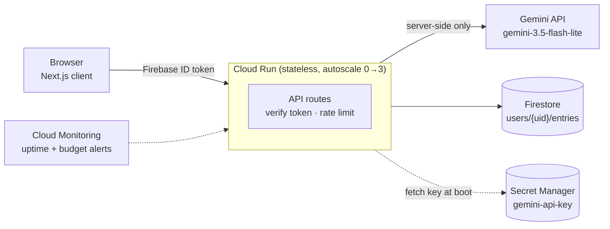

# Personal Gemini Journal

A calm, authenticated journaling app: sign in, brainstorm or write with Gemini, and every
conversation is auto-summarized and saved to your own private history. Built as a
production-grade submission for the Google Gen AI APAC ideathon.

**Live:** https://gemini-journal-1040501010782.asia-south1.run.app
**GCP project:** `gen-ai-academy-491119` (`asia-south1`)

## Requirements → implementation

| Requirement | Implementation |
|---|---|
| Auth | Firebase Authentication (Google Sign-In), ID token verified server-side on every request |
| Multi-turn AI | `gemini-3.5-flash-lite` via `@google/genai`, called server-side only |
| Isolated storage | Cloud Firestore at `users/{uid}/entries/{id}`, enforced by security rules + server-side uid checks |
| Secret management | Gemini key lives only in Secret Manager, fetched by a least-privilege Cloud Run service account |
| Enhancement | **Voice Journal** (continuous Web Speech API input) + a **calendar view** of past entries |

## Architecture



- **Auth boundary**: every `/api/*` route verifies the Firebase ID token via
  `firebase-admin` (`requireUserId`) — invalid/missing token → `401`. No route ever trusts
  a client-supplied uid.
- **Data isolation**: Firestore rules independently enforce `request.auth.uid == uid` as
  defense-in-depth on top of the server-side check; no shared/global collections.
- **Secrets**: Gemini key is only in Secret Manager; the Cloud Run service account has
  `secretmanager.secretAccessor` scoped to that one secret (not `roles/editor`).
- **Rate limiting**: Firestore-backed per-user request counter protects the shared
  free-tier quota during a live demo.
- **Stateless & containerized**: multi-stage Dockerfile, non-root user, Next.js
  `standalone` output, deployed to Cloud Run with autoscaling.

## Resilience

A past cohort was missed when a GCP billing account was silently disabled. This build
treats that as a first-class risk:

- **Uptime check** on `/api/health` (Cloud Monitoring) → email alert on failure.
- **Billing budget alert** ($20, 50/90/100% thresholds) so a disabled/over-limit account
  is caught immediately, not silently.
- Gemini key lives in a project with **no billing account attached**, so it uses the
  standard free tier instead of a paid "prepay" wallet that can silently deplete.

## Phase 1 — AI Studio "constitution"

[`docs/ai-studio-system-instructions.md`](docs/ai-studio-system-instructions.md): the full
custom system instructions used in Google AI Studio before any code was generated —
threat modeling, auth/authz rules, data isolation, and secret management standards.

## One manual step remaining

Firebase Console → Authentication → Sign-in method → enable **Google** → add the Cloud
Run domain under Authorized domains. This is a one-time, human-only console action;
everything else (Firestore, rules, IAM, secrets, Cloud Run, monitoring, budget) is
provisioned programmatically.

## Local development

```bash
cp .env.local.example .env.local   # set GEMINI_API_KEY for local-only testing
npm install && npm run dev
```

## Deploy

```bash
gcloud builds submit --config=cloudbuild.yaml \
  --substitutions=_FIREBASE_API_KEY=...,_FIREBASE_AUTH_DOMAIN=...,_FIREBASE_PROJECT_ID=...,\
_FIREBASE_STORAGE_BUCKET=...,_FIREBASE_SENDER_ID=...,_FIREBASE_APP_ID=...

gcloud run deploy gemini-journal --region=asia-south1 \
  --image=asia-south1-docker.pkg.dev/gen-ai-academy-491119/gemini-journal/app:latest \
  --service-account=gemini-journal-run@gen-ai-academy-491119.iam.gserviceaccount.com
```
